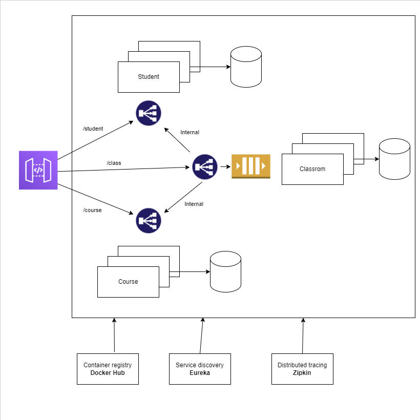
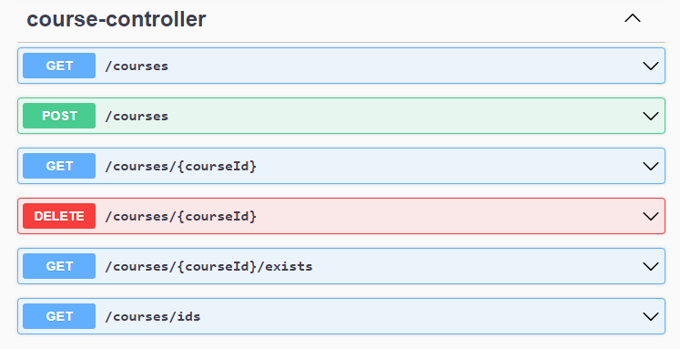
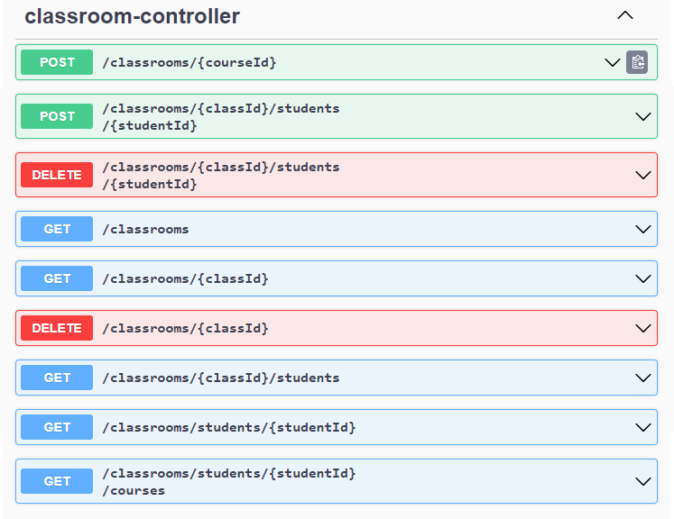
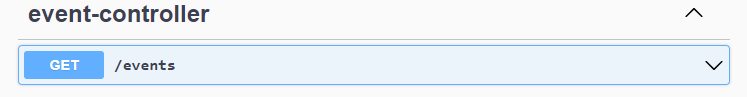

# Students - Spring Cloud project for learning purposes
The app is complete with my previous assumptions. 

## App architecture:

	

Most important info:
* Student microservice - endpoints useful for managing students' data,
* Course microservice - endpoints useful for managing courses,
* Classrom microservice - endpoints useful for managing classes. This server mainly uses student and course microservices e.g. student can be assigned to the specific class and a class is an instance of the specific course,
* Event microservice - stores events from the classroom (only classroom database changes),
* Eureka - microservices communicate with each other by using their names registered in the eureka server. Because of this, there is no need to hardcode host names and ports of microservices many times.

## API documentation:

	

	

	

	

